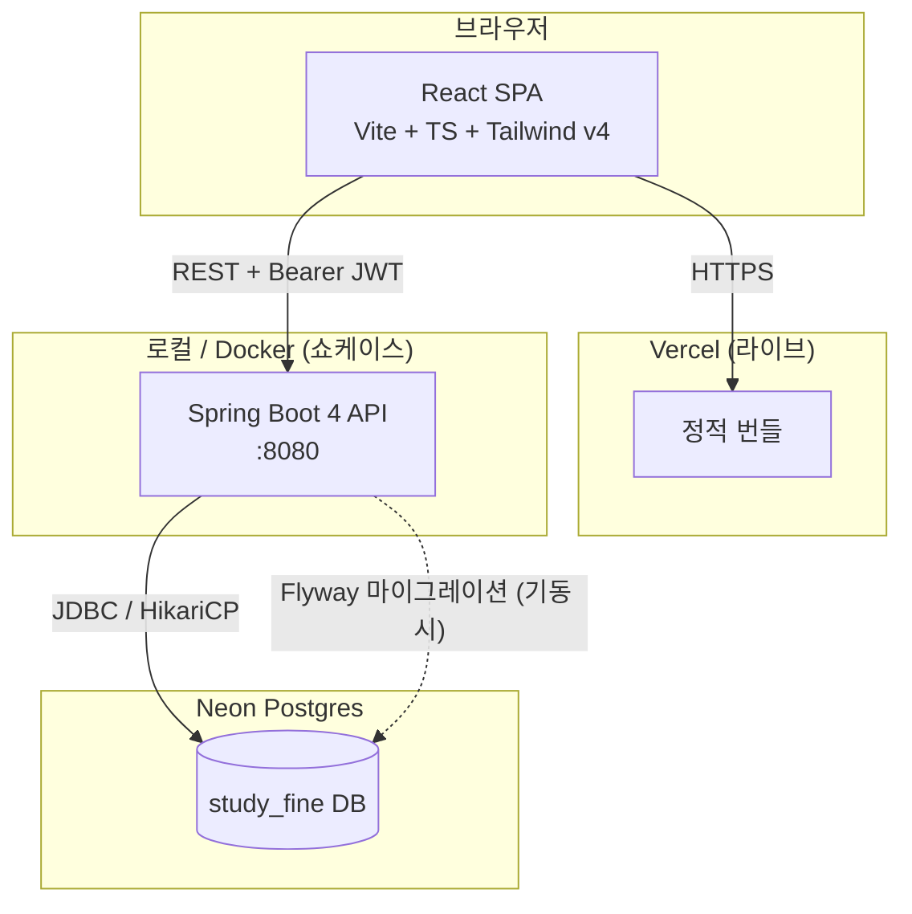
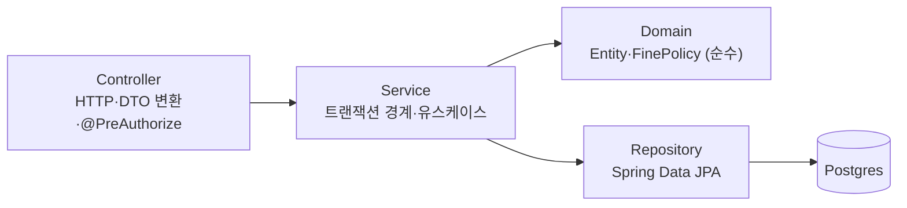
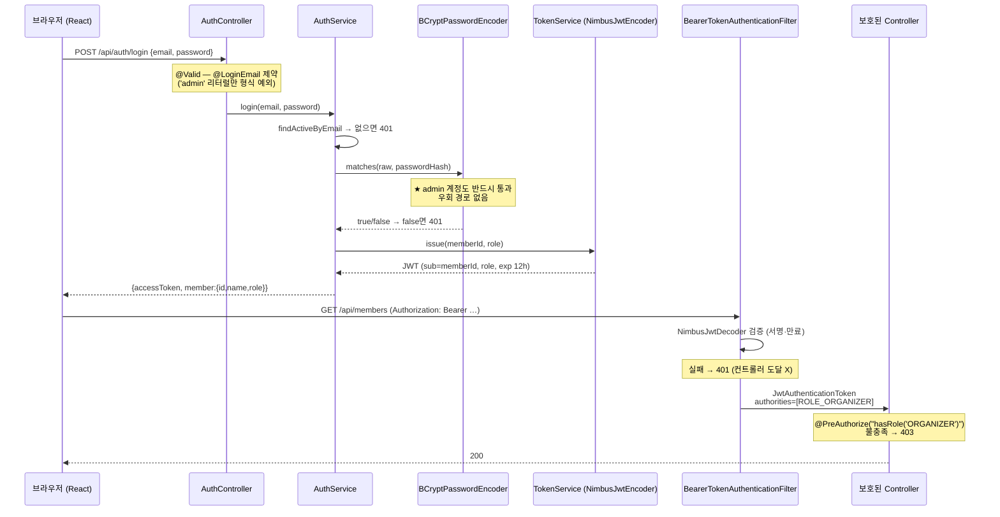
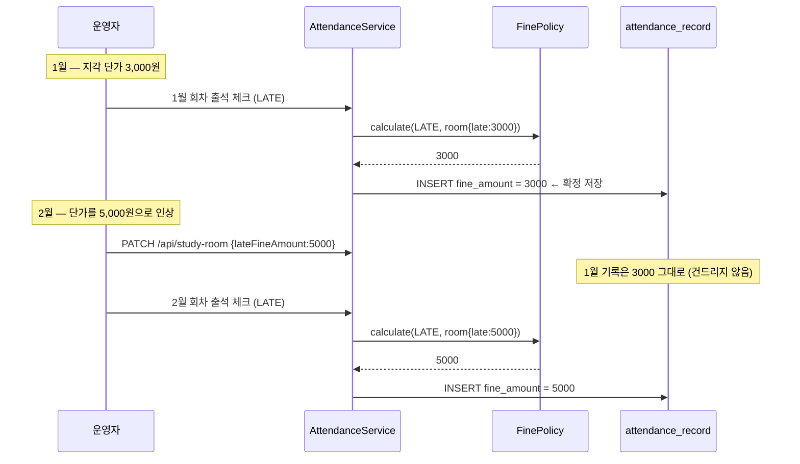
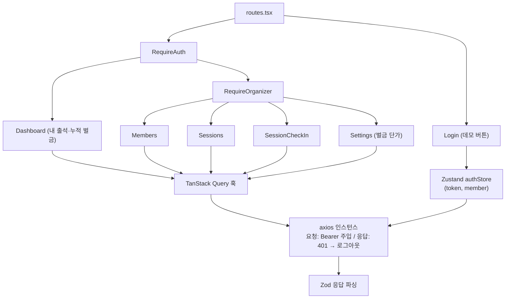

# ARCHITECTURE — study-fine

용어는 [`UBIQUITOUS_LANGUAGE.md`](./UBIQUITOUS_LANGUAGE.md), 범위는 [`SPEC.md`](./SPEC.md) 기준.

---

## 1. 시스템 구성도



## 2. 백엔드 레이어 구조



**규칙**

| 레이어         | 하는 일                                                                            | 절대 안 하는 일                  |
| -------------- | ---------------------------------------------------------------------------------- | -------------------------------- |
| **Controller** | 요청 DTO 검증(`@Valid`), 인증 주체 주입, 권한 선언(`@PreAuthorize`), 응답 DTO 변환 | 비즈니스 규칙, 엔티티 직접 노출  |
| **Service**    | `@Transactional` 경계, 유스케이스 조합, 도메인 규칙 호출, 소유권 검사              | HTTP 타입(`ResponseEntity`) 참조 |
| **Domain**     | 엔티티 불변식, `FinePolicy` 계산                                                   | 스프링 빈 의존, DB 접근          |
| **Repository** | 쿼리 정의, fetch join / projection                                                 | 비즈니스 분기                    |

**엔티티는 컨트롤러 밖으로 나가지 않는다.** 응답은 전부 record DTO (Java 21 record). JPA 지연로딩이 직렬화 시점에 터지는 문제(`LazyInitializationException`)와 응답 스펙이 스키마에 끌려다니는 문제를 동시에 막는다.

### 패키지 구조 (package-by-feature)

```
study-fine/
├─ backend/
│  ├─ src/main/java/com/jakesoneyo/studyfine/
│  │  ├─ StudyFineApplication.java
│  │  ├─ common/
│  │  │  ├─ ApiExceptionHandler.java      # @RestControllerAdvice → RFC 9457 ProblemDetail
│  │  │  ├─ BusinessException.java        # 도메인 예외 기저 클래스
│  │  │  └─ OpenApiConfig.java            # springdoc: Bearer 스키마 등록
│  │  ├─ security/
│  │  │  ├─ SecurityConfig.java           # SecurityFilterChain, PasswordEncoder
│  │  │  ├─ JwtConfig.java                # NimbusJwtEncoder / NimbusJwtDecoder 빈
│  │  │  ├─ TokenService.java             # 발급(sub, role, exp)
│  │  │  ├─ AuthController.java           # POST /api/auth/login, GET /api/auth/me
│  │  │  ├─ CurrentMember.java            # @AuthenticationPrincipal 축약 애노테이션
│  │  │  └─ LoginEmail.java               # 커스텀 제약: 'admin' 리터럴 1건만 형식 예외
│  │  ├─ member/
│  │  │  ├─ Member.java  MemberRole.java
│  │  │  ├─ MemberRepository.java  MemberService.java  MemberController.java
│  │  │  └─ dto/  (MemberCreateRequest, MemberUpdateRequest, MemberSummary …)
│  │  ├─ session/
│  │  │  ├─ StudySession.java
│  │  │  └─ StudySessionRepository/Service/Controller.java + dto/
│  │  ├─ attendance/
│  │  │  ├─ AttendanceRecord.java  AttendanceStatus.java
│  │  │  └─ AttendanceRepository/Service/Controller.java + dto/
│  │  ├─ studyroom/
│  │  │  ├─ StudyRoom.java                # 단일 행 (id=1), 벌금 단가 보유
│  │  │  ├─ FinePolicy.java               # ★ 순수 계산 — 단위 테스트 1급 대상
│  │  │  └─ StudyRoomRepository/Service/Controller.java + dto/
│  │  └─ seed/DemoDataSeeder.java         # ApplicationRunner, 멱등
│  ├─ src/main/resources/
│  │  ├─ application.yml  application-local.yml
│  │  └─ db/migration/V1__init.sql
│  ├─ src/test/java/…                      # FinePolicyTest, SecurityGuardTest
│  ├─ pom.xml  Dockerfile  .env.example
├─ frontend/
│  ├─ src/
│  │  ├─ api/          # axios 인스턴스 + 인터셉터, 도메인별 훅(TanStack Query)
│  │  ├─ schemas/      # Zod 스키마 (요청 검증 + 응답 파싱)
│  │  ├─ stores/       # Zustand: authStore(토큰·현재 멤버)
│  │  ├─ pages/        # Login, Dashboard, Members, Sessions, SessionCheckIn, Settings
│  │  ├─ components/   # 공용 UI
│  │  └─ routes.tsx    # RequireAuth / RequireOrganizer 가드
│  └─ vite.config.ts  vercel.json
├─ .github/workflows/ci.yml
└─ README.md + 이 설계 문서들
```

---

## 3. 기술 선택 근거

| 영역         | 선택                                              | 근거                                                                                                                    |
| ------------ | ------------------------------------------------- | ----------------------------------------------------------------------------------------------------------------------- |
| 런타임       | **Java 21 (LTS)**                                 | Spring Boot 4 최소 요구 버전. record·sealed·패턴매칭 사용 가능                                                          |
| 프레임워크   | **Spring Boot 4.1.x**                             | Boot **3.5는 2026-06-30 OSS EOL** → 신규 프로젝트에 EOL 버전을 쓰는 건 포폴로서 마이너스. 4.1이 신규 프로젝트 권장 라인 |
| 빌드         | **Maven**                                         | Spring Initializr로 생성, Maven Wrapper(`./mvnw`) 사용. 워크스페이스 Dockerfile은 Maven 멀티스테이지로 맞춤 작성        |
| ORM          | **Spring Data JPA (Hibernate 7)**                 | CLAUDE.md 표준. Prisma/TypeORM 대비 "JPA도 다룬다" 다양성 어필                                                          |
| 마이그레이션 | **Flyway**                                        | CLAUDE.md 표준. `ddl-auto=validate` 로 스키마 드리프트 차단                                                             |
| 인증         | **Spring Security 7 + Nimbus JWT (HS256)**        | ↓ ADR-1 참조. jjwt 대신 스프링 내장 사용                                                                                |
| 검증         | **Bean Validation (Jakarta)**                     | CLAUDE.md 표준                                                                                                          |
| API 문서     | **springdoc-openapi 3.1.x** (`starter-webmvc-ui`) | springdoc 3.x 라인이 Spring Boot 4 / Java 21 / OpenAPI 3.1 지원. Boot 4에는 2.x 쓰면 안 됨                              |
| 에러 응답    | **`ProblemDetail` (RFC 9457, Spring 내장)**       | 별도 에러 DTO 클래스를 만들지 않는다(ponytail). 표준 포맷이라 Swagger·프론트 양쪽에서 일관                              |
| 헬스체크     | **Actuator**, `base-path: /`                      | 커스텀 `HealthController` 작성 금지. 설정 한 줄로 `/health` 확보                                                        |
| DB           | **Neon Postgres**                                 | CLAUDE.md 표준(프로젝트당 DB). 로컬 개발도 Neon 브랜치 직결 → docker-compose 불필요                                     |
| 테스트       | **JUnit 5 + Spring Security Test**                | S티어: 벌금 계산(순수 단위) + 권한 가드(`@WebMvcTest` 슬라이스). Testcontainers는 S티어 면제                            |

### ADR-1: JWT 라이브러리 — jjwt ❌ / Nimbus(Spring 내장) ✅

**맥락.** Spring Boot 4는 **Jackson 3**(`tools.jackson.*`)로 이행했다. 흔히 쓰는 `jjwt-jackson`은 Jackson 2(`com.fasterxml.jackson.*`) 바인딩이라, Boot 4에서 클래스패스에 Jackson 2를 되살리거나 `jjwt-gson`으로 우회해야 한다. 어느 쪽이든 하루짜리 프로젝트에서 태울 시간이 아니다.

**결정.** `spring-boot-starter-oauth2-resource-server` 를 쓰고, HS256 대칭키로 `NimbusJwtEncoder` / `NimbusJwtDecoder` 빈을 등록한다.

**결과.**

- 의존성 1개 감소, JSON 바인딩 충돌 없음
- **커스텀 `OncePerRequestFilter`를 작성하지 않는다** — `BearerTokenAuthenticationFilter`가 파싱·검증·401 응답까지 처리
- `JwtAuthenticationConverter`로 `role` 클레임 → `ROLE_ORGANIZER` 권한 매핑만 설정
- 대칭키(HS256)를 고른 이유: 발급자와 검증자가 동일 애플리케이션이므로 RSA 키쌍 관리는 과설계

### ADR-2: Spring Security 7 함정 대응

Boot 4에 딸려오는 Security 7에서 실제로 물리는 것들. 구현 시 이걸 그대로 반영한다.

1. **CSRF가 API 엔드포인트에도 기본 ON** (Security 6까지는 폼 기반에만 적용) → stateless JWT API이므로 `.csrf(AbstractHttpConfigurer::disable)` 를 **명시적으로** 꺼야 한다. 안 끄면 POST/PUT/PATCH/DELETE가 전부 403.
2. **`authorizeRequests()` 완전 제거** → `authorizeHttpRequests()` 만 사용.
3. **`SessionCreationPolicy.STATELESS`** 명시.
4. `@PreAuthorize` 쓰려면 `@EnableMethodSecurity` 필요.

---

## 4. 인증 / 인가 플로우



### 데모 계정 처리 (CLAUDE.md 규정 — 정확히 이 범위만)

| 항목              | 처리                                                                                                               |
| ----------------- | ------------------------------------------------------------------------------------------------------------------ |
| 계정              | email `admin` / password `admin`, role `ORGANIZER`                                                                 |
| 이메일 형식       | **로그인 요청 DTO에만** `@LoginEmail` 커스텀 제약 적용. 구현: `"admin".equals(value) \|\| 표준 이메일 정규식 통과` |
| 멤버 생성 DTO     | 표준 `@Email` — **예외 없음**. 운영자가 만드는 일반 멤버는 항상 진짜 이메일                                        |
| 비밀번호          | BCrypt 해시로 시드. 로그인 시 `passwordEncoder.matches()` 정상 통과 필요. **우회 분기 없음**                       |
| 백도어 엔드포인트 | **없음.** `/api/auth/demo-login` 류 미인증 토큰 발급 엔드포인트 금지                                               |
| 프론트 버튼       | 로그인 폼에 `회원가입 없이 둘러보기` 버튼 → `admin`/`admin` 을 채워 **정규 로그인 API 호출**                       |
| 보조 문구         | `회원가입 없이 체험해 볼 수 있습니다.`                                                                             |

`@LoginEmail` 을 따로 만드는 이유: 로그인 DTO에서 `@Email`을 그냥 빼버리면 _모든_ 비이메일 문자열이 통과한다. 규정은 "`admin` **딱 하나의 리터럴**"이므로, 예외를 리터럴 1건으로 좁히려면 커스텀 제약이 필요하다.

### 소유권 격리 (수평 권한 상승 차단)

`@PreAuthorize` 만으로는 "MEMBER가 남의 id로 조회"를 막지 못한다. 두 겹으로 처리한다.

1. **본인 조회는 전용 경로로** — `GET /api/me/attendances`. 클라이언트가 id를 보내지 않고 토큰의 `sub`를 쓴다. 애초에 남의 것을 지칭할 방법이 없다.
2. **id를 받는 경로는 ORGANIZER 전용** — `/api/members/**` 는 전부 `hasRole('ORGANIZER')`.

→ "id 파라미터와 principal을 매번 비교"하는 방식보다 실수 여지가 적다. 비교를 한 곳에서 빠뜨리면 바로 취약점이 되는 구조 자체를 피한다.

---

## 5. 벌금 계산 설계 (핵심 도메인 로직)

### 5.1 규칙

```
fine(PRESENT, room) = 0
fine(LATE,    room) = room.lateFineAmount
fine(ABSENT,  room) = room.absentFineAmount
```

`FinePolicy` 는 **스프링 빈이 아니고 DB도 모르는 순수 함수**다. 그래서 목(mock) 없이 테스트된다 — S티어 단위 테스트를 저비용으로 만드는 지점.

```java
/** 출석 상태와 스터디룸의 현재 벌금 단가로 벌금을 산출한다. 부작용 없음. */
public static int calculate(AttendanceStatus status, StudyRoom room)
```

### 5.2 스냅샷 원칙 (이 프로젝트의 제1 설계 결정)



`fine_amount` 를 저장하지 않고 조회 시마다 현재 단가로 계산하면, 단가를 올리는 순간 **과거 벌금이 전부 소급 인상**된다. 주문 라인아이템에 주문 시점 가격을 박아두는 것과 같은 이유다. 이게 "정규화하면 되는 거 아니냐"는 반문에 대한 답 — `fine_amount` 는 파생값의 중복이 아니라 **그 시점에 확정된 사실(fact)** 이다.

### 5.3 누적 벌금은 저장하지 않는다

반대로 `member.total_fine` 같은 합계 컬럼은 **두지 않는다.** 출석 기록이 갱신될 때마다 두 곳을 맞춰야 하고, 어긋나면 진실이 두 개가 된다. 누적 벌금은 항상 집계 쿼리로 뽑는다.

- 스터디 규모는 수십 명 · 회차 수십 개 → 행 수가 수천 단위. 집계 비용 무시 가능.
- 성능이 문제되는 규모(수십만 행)가 오면 그때 구체화 뷰를 얹는 게 순서. 지금 넣는 건 과설계.

### 5.4 출석 체크 = 단일 트랜잭션 bulk upsert

`PUT /api/sessions/{id}/attendances` 한 번에 멤버 전원 상태가 들어온다.

```
@Transactional
1. StudyRoom 1회 로드 (단가 스냅샷 소스)
2. 해당 회차의 기존 출석 기록을 Map<memberId, record> 로 1회 조회   ← 멤버마다 findBy 금지 (N+1)
3. 요청 멤버 id 들이 전부 실재하는 활성 멤버인지 1회 조회로 검증
4. 있으면 update(status, fineAmount), 없으면 insert
5. 커밋 — 부분 저장 없음
```

멤버별로 `findBySessionAndMember` 를 도는 순간 N+1이 된다. 2·3번의 "1회 조회 후 맵 조회" 가 이 설계의 요점.

---

## 6. N+1 방지 지점 (전수)

| 화면/엔드포인트              | 나이브 구현의 문제                                    | 대응                                                                            |
| ---------------------------- | ----------------------------------------------------- | ------------------------------------------------------------------------------- |
| 멤버 목록 + 누적 벌금        | 멤버 N명 → 벌금 합계 쿼리 N번                         | `LEFT JOIN attendance_record … GROUP BY member.id` **DTO projection 단일 쿼리** |
| 회차 상세 (출석 현황)        | 출석 M건 → `record.getMember().getName()` 마다 SELECT | `@EntityGraph(attributePaths = "member")` 또는 `join fetch`                     |
| 내 출석 내역                 | 기록마다 회차 SELECT                                  | `join fetch ar.studySession`                                                    |
| 회차 목록 + 회차별 벌금 합계 | 회차 N개 → 합계 N번                                   | 단일 GROUP BY projection                                                        |
| 출석 체크 bulk 저장          | 멤버마다 조회/저장                                    | 5.4 절 — 사전 1회 조회 + 맵                                                     |

**전역 기본값:** 모든 `@ManyToOne` 은 `fetch = LAZY` 명시 (JPA 기본값이 EAGER라 그냥 두면 안 됨).
**검증 수단:** `spring.jpa.properties.hibernate.generate_statistics=true` + 로컬 로그로 쿼리 수 확인. (S티어라 자동화된 쿼리 카운트 테스트는 생략)

---

## 7. 프론트엔드 구조



**상태 분리 원칙** — 서버에서 온 데이터는 전부 TanStack Query가 소유한다. Zustand에는 **토큰과 현재 로그인 멤버만** 둔다. 서버 데이터를 Zustand에 복사하는 순간 캐시가 두 개가 되고 무효화 타이밍이 어긋난다.

**역할 기반 라우팅** — `MEMBER` 로 로그인하면 운영자 메뉴가 렌더링되지 않는다. 다만 이건 UX일 뿐이고, **실제 방어선은 서버의 `@PreAuthorize`** 다. 프론트 가드는 보안 경계가 아니다.

**토큰 보관** — `localStorage`. 새로고침 유지가 필요하고 XSS 방어를 위해서는 httpOnly 쿠키가 정석이지만, 그건 CSRF 대응·쿠키 도메인 설정을 수반한다(Vercel ↔ 로컬 백엔드 크로스 오리진). S티어 범위에서는 localStorage + 짧은 만료(12h)로 두고, **이 트레이드오프를 README에 명시**한다. 모르고 한 게 아니라 알고 고른 것으로 남긴다.

---

## 8. 에러 처리 일관성

`@RestControllerAdvice` 하나가 전부 `ProblemDetail` 로 변환한다.

| 상황                       | HTTP | title                                              |
| -------------------------- | ---- | -------------------------------------------------- |
| Bean Validation 실패       | 400  | 입력값이 올바르지 않습니다 (필드별 오류 배열 동봉) |
| 인증 실패 / 토큰 없음·만료 | 401  | 인증이 필요합니다                                  |
| 권한 부족                  | 403  | 권한이 없습니다                                    |
| 리소스 없음                | 404  | 대상을 찾을 수 없습니다                            |
| 중복 (이메일, 회차 날짜)   | 409  | 이미 존재합니다                                    |
| 그 외                      | 500  | 서버 오류                                          |

**500 응답에는 스택트레이스·예외 메시지를 절대 싣지 않는다.** 서버 로그에만 남기고 클라이언트에는 고정 문구 + `traceId` 만.

---

## 9. 설정 / 시크릿

| 키                     | 용도                    | 비고                                              |
| ---------------------- | ----------------------- | ------------------------------------------------- |
| `DATABASE_URL`         | Neon 커넥션 문자열      | `.env` — 커밋 금지                                |
| `JWT_SECRET`           | HS256 대칭키            | **32바이트 이상** (HS256 최소 키 길이). 커밋 금지 |
| `JWT_EXPIRATION_HOURS` | 토큰 만료 (기본 12)     |                                                   |
| `APP_SEED_ENABLED`     | 데모 시드 실행 여부     | 기본 `true` (포폴 데모 목적)                      |
| `CORS_ALLOWED_ORIGINS` | 프론트 오리진 허용 목록 | 와일드카드 `*` 금지 — 명시적 목록만               |

`.env.example` 만 저장소에 둔다. `application.yml` 은 `${DATABASE_URL}` 형태로 참조만 하고 기본값에 실제 값을 넣지 않는다.

---

## 10. 빌드 / CI / 배포

**CI** (`.github/workflows/ci.yml`) — 잡 2개 병렬

- `backend`: Temurin 21 셋업 → Maven 캐시 → `./mvnw -DskipTests package` (컴파일 + 단위 테스트)
- `frontend`: Node 22 → `npm ci` → `tsc --noEmit` → `vite build`

DB가 필요한 테스트가 없으므로 CI에 Postgres 서비스 컨테이너를 띄우지 않는다.

**Docker** — 워크스페이스 `spring/Dockerfile` 템플릿(멀티스테이지, `eclipse-temurin:21`, `bootJar`) 그대로 사용.

**배포**

- 프론트 → **Vercel 라이브** (`VITE_API_BASE_URL` 환경변수)
- 백엔드 → **로컬 쇼케이스**. 워크스페이스 규칙상 Spring은 Render 무료 512MB에서 OOM 위험 → README에 Docker 실행법 + 데모 GIF
- Flyway 마이그레이션은 앱 기동 시 자동 실행. `spring.jpa.hibernate.ddl-auto=validate` 로 스키마-엔티티 불일치를 기동 시점에 잡는다

> **Flyway 주의 (Boot 4).** `spring-boot-starter-flyway` 와 함께 **`flyway-database-postgresql` 아티팩트를 반드시 명시**해야 한다. 누락하면 기동 시 `Unsupported Database: PostgreSQL <버전>` 으로 실패한다. 또한 Neon의 Postgres 메이저 버전을 지원하는 Flyway 버전인지 확인하고 필요하면 명시적으로 올린다.
