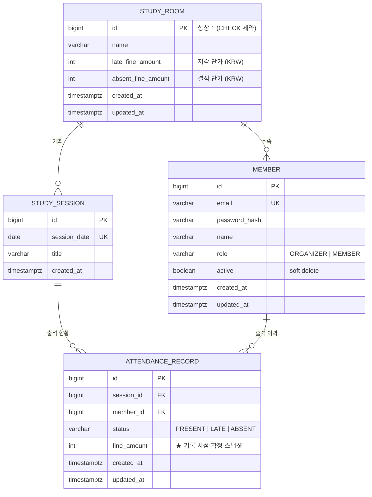

# DATA-MODEL — study-fine

DB: **Neon Postgres** · ORM: **Spring Data JPA (Hibernate 7)** · 마이그레이션: **Flyway**
용어는 [`UBIQUITOUS_LANGUAGE.md`](./UBIQUITOUS_LANGUAGE.md) 기준.

---

## 1. ERD



---

## 2. 테이블 상세

### 2.1 `study_room` — 단일 행 설정 테이블

| 컬럼                 | 타입          | 제약                     | 설명                 |
| -------------------- | ------------- | ------------------------ | -------------------- |
| `id`                 | `bigint`      | PK, `CHECK (id = 1)`     | 싱글턴 강제          |
| `name`               | `varchar(60)` | NOT NULL                 | 스터디룸 이름        |
| `late_fine_amount`   | `integer`     | NOT NULL, `CHECK (>= 0)` | 지각 벌금 단가 (KRW) |
| `absent_fine_amount` | `integer`     | NOT NULL, `CHECK (>= 0)` | 결석 벌금 단가 (KRW) |
| `created_at`         | `timestamptz` | NOT NULL DEFAULT `now()` |                      |
| `updated_at`         | `timestamptz` | NOT NULL DEFAULT `now()` |                      |

**왜 테이블인가.** 벌금 단가를 `application.yml` 이나 상수로 두면 운영자가 못 바꾼다(기획 확정 사항: "하드코딩 금지, 운영자가 조정 가능"). 재배포 없이 런타임에 바뀌어야 하므로 DB가 맞다.

**왜 단일 행인가.** 멀티 스터디룸은 명시적 비범위. `CHECK (id = 1)` 로 두 번째 행 생성을 DB 레벨에서 막는다. 애플리케이션 코드는 항상 `findById(1L)`. 나중에 멀티테넌시로 확장하면 이 CHECK만 떼고 `member.study_room_id` FK를 살리면 되므로 확장 경로가 막히지 않는다.

> `member`/`study_session` 에 `study_room_id` 컬럼은 **두지 않는다.** 값이 항상 1이라 정보량이 0인 컬럼이고, 지금 넣으면 모든 쿼리에 무의미한 조건이 붙는다. (ponytail — 필요해지는 시점에 마이그레이션으로 추가)

### 2.2 `member`

| 컬럼            | 타입           | 제약                                        | 설명                     |
| --------------- | -------------- | ------------------------------------------- | ------------------------ |
| `id`            | `bigint`       | PK, `GENERATED BY DEFAULT AS IDENTITY`      |                          |
| `email`         | `varchar(255)` | NOT NULL, **UNIQUE**                        | 로그인 ID (`admin` 포함) |
| `password_hash` | `varchar(72)`  | NOT NULL                                    | BCrypt 해시 (60자)       |
| `name`          | `varchar(50)`  | NOT NULL                                    | 표시 이름                |
| `role`          | `varchar(20)`  | NOT NULL, `CHECK IN ('ORGANIZER','MEMBER')` | `@Enumerated(STRING)`    |
| `active`        | `boolean`      | NOT NULL DEFAULT `true`                     | soft delete 플래그       |
| `created_at`    | `timestamptz`  | NOT NULL DEFAULT `now()`                    |                          |
| `updated_at`    | `timestamptz`  | NOT NULL DEFAULT `now()`                    |                          |

**enum을 `varchar + CHECK` 로 저장하는 이유.** `@Enumerated(ORDINAL)` 은 enum 상수 순서만 바꿔도 기존 데이터의 의미가 통째로 뒤집힌다. Postgres 네이티브 `ENUM` 타입은 값 추가/삭제 마이그레이션이 번거롭다. 문자열 + CHECK 가 가독성(DB를 직접 열어봐도 읽힘)과 변경 용이성의 균형점.

**soft delete 이유.** 멤버를 물리 삭제하면 그가 쌓은 출석 기록과 벌금 근거가 함께 사라지거나 FK 위반이 난다. `active = false` 로 명단에서만 내리고 이력은 보존한다.

### 2.3 `study_session` — 회차

| 컬럼           | 타입           | 제약                     | 설명                 |
| -------------- | -------------- | ------------------------ | -------------------- |
| `id`           | `bigint`       | PK, IDENTITY             |                      |
| `session_date` | `date`         | NOT NULL, **UNIQUE**     | 모임 날짜 (KST 기준) |
| `title`        | `varchar(100)` | NOT NULL                 | 회차 제목            |
| `created_at`   | `timestamptz`  | NOT NULL DEFAULT `now()` |                      |

**왜 별도 테이블인가.** 기획 단계에서는 출석 기록이 `session_date` 를 직접 들고 `UNIQUE(member_id, session_date)` 를 거는 안이 나왔다. 그렇게 하면

- 회차 목록을 뽑으려면 `SELECT DISTINCT session_date FROM attendance_record` 를 해야 하고,
- **출석 기록이 하나도 없는 회차는 존재 자체가 표현되지 않으며**(= "만들어는 뒀는데 아직 체크 안 한 회차"가 사라짐),
- 회차 제목 같은 속성을 걸 곳이 없다.

회차는 그 자체로 도메인 개념(1급 엔티티)이다. 테이블 1개 + 단순 CRUD 비용으로 위 문제가 전부 사라지므로 분리한다. → 유니크 제약도 `(session_id, member_id)` 로 이동.

`date` 타입인 이유: 모임은 "그 날"의 일이지 시각의 일이 아니다. `timestamptz` 로 두면 타임존 때문에 날짜가 하루 밀리는 고전 버그가 생긴다.

### 2.4 `attendance_record` — 출석 기록

| 컬럼          | 타입          | 제약                                                     | 설명                               |
| ------------- | ------------- | -------------------------------------------------------- | ---------------------------------- |
| `id`          | `bigint`      | PK, IDENTITY                                             |                                    |
| `session_id`  | `bigint`      | NOT NULL, FK → `study_session(id)` **ON DELETE CASCADE** | 회차 삭제 시 함께 삭제             |
| `member_id`   | `bigint`      | NOT NULL, FK → `member(id)` **ON DELETE RESTRICT**       | 멤버 물리 삭제 차단(soft delete만) |
| `status`      | `varchar(10)` | NOT NULL, `CHECK IN ('PRESENT','LATE','ABSENT')`         |                                    |
| `fine_amount` | `integer`     | NOT NULL, `CHECK (>= 0)`                                 | **기록 시점 확정 스냅샷**          |
| `created_at`  | `timestamptz` | NOT NULL DEFAULT `now()`                                 |                                    |
| `updated_at`  | `timestamptz` | NOT NULL DEFAULT `now()`                                 |                                    |

**`fine_amount` 는 비정규화가 아니다.** "출석 상태 + 현재 단가로 계산 가능한 값을 왜 저장하냐"는 지적이 자연스럽지만, 저장하지 않으면 운영자가 단가를 올리는 순간 **과거 벌금이 전부 소급 인상**된다. 이 컬럼은 파생값 캐시가 아니라 *그 시점에 확정된 사실*이다 — 주문서에 주문 당시 상품 가격을 박아두는 것과 동일한 이유. (상세: ARCHITECTURE.md §5.2)

**FK 삭제 정책이 좌우 다른 이유.**

- 회차 삭제 → 그 회차의 출석 기록은 존재 의미가 없다 → `CASCADE`
- 멤버 삭제 → 벌금 근거가 날아간다 → `RESTRICT`. 앱은 항상 `active=false` 로 처리하므로 이 제약에 걸릴 일이 없고, 걸린다면 그건 잘못된 코드라는 신호다

**합계 컬럼(`member.total_fine`)을 두지 않는 이유.** 출석 기록이 갱신될 때마다 두 곳을 동기화해야 하고, 어긋나면 진실이 두 개가 된다. 누적 벌금은 항상 집계 쿼리로 산출한다. 데이터 규모(멤버 수십 × 회차 수십 = 수천 행)에서 집계 비용은 무시 가능하다.

---

## 3. 인덱스

꼭 필요한 것만. 인덱스는 공짜가 아니다(쓰기 비용 + 용량).

| 테이블              | 인덱스                    | 종류   | 근거                                                                                            |
| ------------------- | ------------------------- | ------ | ----------------------------------------------------------------------------------------------- |
| `member`            | `email`                   | UNIQUE | 로그인 시 매 요청 조회 + 중복 가입 차단. 제약과 인덱스를 동시에 해결                            |
| `study_session`     | `session_date`            | UNIQUE | 같은 날 회차 중복 생성 차단 + 날짜 정렬 목록 조회                                               |
| `attendance_record` | `(session_id, member_id)` | UNIQUE | **한 회차에 한 멤버는 1건**. 재저장(bulk upsert) 시 중복 방지의 최종 방어선. 회차별 조회도 커버 |
| `attendance_record` | `member_id`               | 일반   | **멤버별 누적 벌금 집계 / 내 출석 내역 조회의 핵심 경로**                                       |

### 왜 `member_id` 인덱스를 따로 만드는가 (면접 포인트)

두 가지가 걸린다.

1. **Postgres는 FK를 걸어도 인덱스를 자동 생성하지 않는다.** (참조되는 쪽 PK에만 인덱스가 있고, 참조하는 쪽 컬럼은 없다.) MySQL 습관으로 "FK니까 인덱스 있겠지" 하면 틀린다.
2. **복합 유니크 `(session_id, member_id)` 는 `member_id` 단독 조회에 못 쓴다.** 복합 인덱스는 **선두 컬럼(leftmost prefix)** 부터 써야 유효하다. `WHERE member_id = ?` 는 이 인덱스를 타지 못하고 풀스캔한다.

`GET /api/me/attendances` 와 멤버별 누적 벌금 집계가 정확히 `member_id` 로 필터링하므로 단독 인덱스가 필요하다.

**반대로 만들지 않는 것들**

- `attendance_record.session_id` 단독 → 복합 유니크의 선두 컬럼이라 이미 커버됨. 중복
- `member.role`, `member.active` → 카디널리티 2~3. 수십 행 테이블에서 풀스캔이 더 빠르다
- `attendance_record.status` → 위와 동일. 집계는 어차피 전체 스캔

---

## 4. 주요 쿼리 (N+1 회피 형태)

### 4.1 멤버 목록 + 누적 벌금 — 단일 쿼리

```sql
SELECT m.id, m.name, m.email, m.role, m.active,
       COALESCE(SUM(ar.fine_amount), 0)                      AS accumulated_fine,
       COUNT(ar.id) FILTER (WHERE ar.status = 'LATE')        AS late_count,
       COUNT(ar.id) FILTER (WHERE ar.status = 'ABSENT')      AS absent_count
FROM member m
LEFT JOIN attendance_record ar ON ar.member_id = m.id
GROUP BY m.id
ORDER BY accumulated_fine DESC, m.name;
```

`LEFT JOIN` 이어야 출석 기록이 없는 신규 멤버도 0원으로 나온다. JPA에서는 인터페이스 projection 또는 `new` 표현식 DTO 로 받는다 — **엔티티로 받아서 자바에서 합계 내면 그게 N+1이다.**

### 4.2 회차 상세 (전체 출석 현황)

```java
@EntityGraph(attributePaths = "member")
List<AttendanceRecord> findByStudySessionId(Long sessionId);
```

`member` 를 fetch join 하지 않으면 출석 M건에 대해 `member` SELECT가 M번 나간다.

### 4.3 내 출석 내역

```java
@Query("""
    select ar from AttendanceRecord ar
    join fetch ar.studySession s
    where ar.member.id = :memberId
    order by s.sessionDate desc
""")
```

### 4.4 출석 체크 bulk upsert 사전 조회

```java
// 멤버마다 findBySessionAndMember 를 도는 순간 N+1. 한 번에 가져와 맵으로.
Map<Long, AttendanceRecord> existing = repo.findByStudySessionId(sessionId).stream()
        .collect(toMap(r -> r.getMember().getId(), identity()));
```

---

## 5. 금액 타입: `integer` (KRW)

- **`BigDecimal`을 쓰지 않는다.** KRW는 소수점이 없다. 벌금 단가는 천 원 단위. `integer` 최대값 21억 원이면 스터디 벌금엔 차고 넘친다.
- **누적 합계는 `long` 으로 받는다.** `SUM(integer)` 결과는 Postgres에서 `bigint` 다. Java 쪽 projection 타입을 `int` 로 잡으면 매핑 예외가 난다.
- 통화 컬럼도 두지 않는다. 단일 스터디룸 · KRW 고정.

---

## 6. 마이그레이션 전략

### 원칙

- **스키마 변경은 오직 Flyway 로만.** `spring.jpa.hibernate.ddl-auto=validate` 고정 — `update` 는 절대 금지(예고 없이 스키마를 건드리고, 컬럼 삭제/타입 변경은 조용히 무시한다)
- `validate` 덕분에 엔티티와 실제 스키마가 어긋나면 **앱 기동 시점에 즉시 실패**한다. 런타임에 이상한 에러로 만나는 것보다 낫다
- 적용된 마이그레이션 파일은 **절대 수정하지 않는다** — 체크섬 불일치로 기동이 막힌다. 항상 새 버전 파일 추가

### 파일

```
backend/src/main/resources/db/migration/
└─ V1__init.sql        # 4개 테이블 + 제약 + 인덱스 + study_room 단일 행 INSERT
```

`V1__init.sql` 이 하는 일

1. `study_room`, `member`, `study_session`, `attendance_record` 생성 (제약 포함)
2. 위 §3 인덱스 생성
3. `INSERT INTO study_room (id, name, late_fine_amount, absent_fine_amount) VALUES (1, '스터디룸', 3000, 5000)`
   — 앱 기동 시 항상 존재해야 하는 설정 행이므로 **시드 데이터가 아니라 스키마의 일부**로 취급. 데모 데이터와 달리 프로덕션에서도 필요하다

### 데모 시드는 Flyway가 아니다

`admin` 계정과 샘플 데이터는 `DemoDataSeeder`(`ApplicationRunner`)로 넣는다.

- BCrypt 해시를 SQL 리터럴로 박으면 강도(strength) 변경 시 손댈 수 없고, 해시를 소스에 커밋하는 것도 좋지 않다
- `APP_SEED_ENABLED=false` 로 끌 수 있어야 한다(Flyway 마이그레이션은 못 끈다)
- **멱등** — `if (memberRepository.existsByEmail("admin")) return;` 로 이미 있으면 통째로 스킵

시드 내용

| 대상      | 내용                                                                           |
| --------- | ------------------------------------------------------------------------------ |
| 운영자    | `admin` / `admin` (BCrypt), name `굴리자`, role `ORGANIZER`                    |
| 멤버 3명  | `member1~3@studyfine.dev`, 각 임의 비밀번호, role `MEMBER`                     |
| 회차 2개  | 최근 2주 내 날짜 2건                                                           |
| 출석 기록 | 4명 × 2회차 = 8건, `PRESENT`/`LATE`/`ABSENT` 섞어서 **누적 벌금이 0이 아니게** |

목적은 면접관이 데모 로그인 직후 **빈 화면을 보지 않는 것**이다. 벌금이 전부 0원이면 핵심 기능이 안 보인다.
