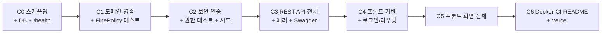

# PLAN — study-fine

난이도 **S (하루 완성)** · 백엔드 Java 21 + Spring Boot 4 · 프론트 Vite + React + TS + Tailwind v4

**청크 = implementer(Sonnet) 서브에이전트에 넘기는 작업 단위.** 콜드스타트 오버헤드를 줄이려고 굵게 묶었다. 각 청크는 "완료 조건"을 통과해야 다음으로 넘어간다.

전제: 모든 청크는 [`SPEC.md`](./SPEC.md) · [`ARCHITECTURE.md`](./ARCHITECTURE.md) · [`DATA-MODEL.md`](./DATA-MODEL.md) · [`API.md`](./API.md) · [`UBIQUITOUS_LANGUAGE.md`](./UBIQUITOUS_LANGUAGE.md) 를 읽고 시작한다.

---

## 전체 흐름



예상 배분: C0~~C3 (백엔드) ≈ 하루의 60%, C4~~C5 (프론트) ≈ 30%, C6 ≈ 10%.

---

## C0 — 스캐폴딩 · DB 연결 · 헬스체크

**목표:** 빈 껍데기지만 기동되고, DB에 붙고, `/health` 가 200을 주고, Swagger가 뜬다.

**작업**

1. `server/` Maven 프로젝트 (Spring Initializr 기준, Java 21, `com.jakesoneyo.studyfine`)
2. 의존성
   - `spring-boot-starter-web`, `-data-jpa`, `-validation`, `-security`, `-oauth2-resource-server`, `-actuator`
   - `spring-boot-starter-flyway` + **`flyway-database-postgresql`** ← 누락 시 `Unsupported Database: PostgreSQL` 로 기동 실패
   - `org.postgresql:postgresql`
   - `org.springdoc:springdoc-openapi-starter-webmvc-ui:3.1.x` ← Boot 4에는 **2.x 쓰면 안 됨**
   - test: `spring-boot-starter-test`, `spring-security-test`
3. Neon 프로젝트 생성 → `study_fine` DB. `.env` + `.env.example` (`DATABASE_URL`, `JWT_SECRET`, `JWT_EXPIRATION_HOURS`, `APP_SEED_ENABLED`, `CORS_ALLOWED_ORIGINS`)
4. `application.yml`
   - `spring.jpa.hibernate.ddl-auto: validate` (고정)
   - `spring.jpa.open-in-view: false` ← 기본값 `true`는 뷰 렌더까지 영속성 컨텍스트를 붙들어 커넥션을 낭비하고 지연로딩 N+1을 숨긴다. 반드시 끈다
   - `management.endpoints.web.base-path: /` → `/health`
   - `spring.jpa.properties.hibernate.generate_statistics: true` (local 프로파일만)
5. 빈 `V1__init.sql` 자리만 잡고(내용은 C1) 기동 확인
6. `.gitignore` (`.env`, `target/`, `node_modules/`)
7. git init + `chore: 프로젝트 스캐폴딩` 커밋

**완료 조건**

- `./mvnw spring-boot:run` → `GET /health` 200 `{"status":"UP"}`
- `/swagger-ui.html` 접속됨
- `.env` 가 `git status` 에 안 잡힘

**함정**

- Boot 4 = **Jackson 3**(`tools.jackson.*`). `com.fasterxml.jackson` 을 import 하는 코드/의존성 추가 금지.
- Security를 넣는 순간 전 경로가 기본 잠긴다. C0 단계에서는 `/health`, `/swagger-ui/**`, `/v3/api-docs/**` `permitAll` 만 임시로 열어두고 상세는 C2에서.

---

## C1 — 도메인 · 영속 계층 · 벌금 계산 (TDD)

**목표:** 스키마와 엔티티가 맞물리고, **벌금 계산 로직이 테스트로 고정**된다.

**작업**

1. **`V1__init.sql` 작성** — DATA-MODEL.md §2·§3 그대로
   - 4개 테이블 + CHECK 제약 + FK(`session_id` CASCADE / `member_id` RESTRICT)
   - 인덱스 4개: `member(email)` UK, `study_session(session_date)` UK, `attendance_record(session_id, member_id)` UK, `attendance_record(member_id)` 일반
   - `study_room` id=1 행 INSERT (`CHECK (id = 1)` 포함)
2. **엔티티** — `StudyRoom`, `Member`(+`MemberRole`), `StudySession`, `AttendanceRecord`(+`AttendanceStatus`)
   - 모든 `@ManyToOne` 에 **`fetch = FetchType.LAZY` 명시** (JPA 기본이 EAGER)
   - enum은 `@Enumerated(EnumType.STRING)` (ORDINAL 금지 — 순서 바뀌면 데이터 의미가 뒤집힘)
   - 기본 생성자는 `protected`, 세터 남발 금지 — 상태 변경은 의도가 드러나는 메서드로 (`member.deactivate()`, `record.updateStatus(status, fineAmount)`)
3. **★ `FinePolicy`** — 스프링 빈 아님, DB 모름, 순수 static
   ```java
   public static int calculate(AttendanceStatus status, StudyRoom room)
   ```
4. **`FinePolicyTest` (JUnit 5)** — 먼저 쓰고 구현
   - `PRESENT` → 0 (단가가 얼마든)
   - `LATE` → `lateFineAmount`
   - `ABSENT` → `absentFineAmount`
   - 단가 0원 → 0
   - `@ParameterizedTest` 로 3상태 × 여러 단가 조합
   - **스냅샷 성질 명시 테스트**: 계산 결과를 받아둔 뒤 room 단가를 바꿔도 이전 결과값이 변하지 않음 (계산이 순수함을 문서화)
5. **리포지토리 + 쿼리** (DATA-MODEL.md §4)
   - `MemberRepository`: `findByEmailAndActiveTrue`, `existsByEmail`, **누적 벌금 집계 projection**(§4.1 GROUP BY 단일 쿼리)
   - `StudySessionRepository`: `existsBySessionDate`, 회차별 집계 projection
   - `AttendanceRepository`: `@EntityGraph("member")` 로 회차별 조회, `join fetch studySession` 로 멤버별 조회
   - 집계 반환 타입은 **`long`** (`SUM(int)` → `bigint`)
6. 커밋: `feat: 도메인 엔티티·스키마 마이그레이션`, `feat: 벌금 계산 정책 + 단위 테스트`

**완료 조건**

- 기동 시 Flyway V1 적용 + `ddl-auto=validate` 통과 (엔티티↔스키마 불일치 0)
- `./mvnw test` 그린, `FinePolicyTest` 전 케이스 통과

**함정**

- `validate` 실패는 대부분 컬럼명 스네이크/카멜 불일치. 네이밍 전략 기본값(`camelCase` → `snake_case`) 신뢰하고, 어긋나면 `@Column(name=…)` 로 명시.
- `SUM` 결과를 `int` projection으로 받으면 런타임 매핑 예외.

---

## C2 — 보안 · 인증 · 권한 · 시드 (TDD)

**목표:** 로그인해서 토큰을 받고, 권한 매트릭스(API.md §16)가 테스트로 강제되고, 데모 데이터가 들어간다.

**작업**

1. **`SecurityConfig`** — ARCHITECTURE.md ADR-2 반영
   - `.csrf(AbstractHttpConfigurer::disable)` ← **Security 7은 API에도 CSRF 기본 ON.** 안 끄면 모든 쓰기 요청 403
   - `authorizeHttpRequests()` (`authorizeRequests()` 는 제거됨)
   - `SessionCreationPolicy.STATELESS`
   - `permitAll`: `/health`, `/swagger-ui/**`, `/v3/api-docs/**`, `POST /api/auth/login`. 나머지 `authenticated()`
   - `@EnableMethodSecurity` (`@PreAuthorize` 활성화)
   - `BCryptPasswordEncoder` 빈
   - CORS: `CORS_ALLOWED_ORIGINS` 목록 기반. **와일드카드 `*` 금지**
2. **`JwtConfig`** — HS256 대칭키
   - `JwtEncoder` = `NimbusJwtEncoder(new ImmutableSecret<>(secretKey))`
   - `JwtDecoder` = `NimbusJwtDecoder.withSecretKey(key).macAlgorithm(HS256).build()`
   - `JwtAuthenticationConverter`: `role` 클레임 → `ROLE_` 접두 권한 매핑
   - **커스텀 필터 작성 금지** — `BearerTokenAuthenticationFilter` 가 이미 한다
   - `JWT_SECRET` 32바이트 미만이면 기동 시 명확한 메시지로 실패시킬 것
3. **`@LoginEmail`** 커스텀 제약 (`ConstraintValidator`)
   - `"admin".equals(value) || 표준 이메일 형식` — **리터럴 1건만 예외**
   - 로그인 DTO에만 적용. 멤버 생성 DTO는 표준 `@Email`
4. **`AuthService` / `AuthController`** — API.md #2, #3
   - 실패 3종(계정 없음/비번 불일치/비활성)은 **동일 401 메시지** (사용자 열거 방지)
   - `passwordEncoder.matches()` 를 **모든 계정에** 적용. admin 우회 분기 금지
5. **`DemoDataSeeder`** (`ApplicationRunner`) — DATA-MODEL.md §6
   - `APP_SEED_ENABLED` 로 on/off
   - `existsByEmail("admin")` 이면 즉시 return (멱등)
   - admin(ORGANIZER, 이름 `굴리자`) + 멤버 3명 + 회차 2개 + 출석 8건(PRESENT/LATE/ABSENT 혼합)
   - **벌금 합계가 0이 아니게** — 0이면 핵심 기능이 화면에 안 보인다
6. **권한 가드 테스트** — API.md §16 표가 곧 명세
   - `@WebMvcTest` + `spring-security-test` 의 `jwt()` 요청 후처리기
   - 토큰 없음 → 401 / MEMBER 토큰으로 ORGANIZER 엔드포인트 → 403 / ORGANIZER → 통과
   - 최소: `PATCH /api/study-room`, `GET /api/members`, `PUT /api/sessions/{id}/attendances` 3개 + `GET /api/me/attendances` (MEMBER 200)
   - 로그인 실패 401 테스트 포함
7. 커밋: `feat: JWT 인증·권한 설정`, `feat: 데모 시드 데이터`, `test: 권한 가드 테스트`

**완료 조건**

- `curl -X POST /api/auth/login -d '{"email":"admin","password":"admin"}'` → 토큰
- 잘못된 비밀번호 → 401
- 권한 테스트 전부 그린
- 앱 두 번 재기동해도 시드 데이터 중복 없음

**함정 (Security 7 신규 동작)**

- CSRF 미해제 → **POST/PUT/PATCH/DELETE 전부 403.** 증상이 "권한 문제"처럼 보여서 오래 헤맨다. 쓰기 요청이 403이면 먼저 CSRF부터 의심
- `@PreAuthorize("hasRole('ORGANIZER')")` 는 권한 문자열이 `ROLE_ORGANIZER` 여야 매칭된다. 컨버터에서 접두사 확인
- `@WebMvcTest` 는 `SecurityConfig` 를 자동으로 안 올린다 → `@Import(SecurityConfig.class)` 필요

---

## C3 — REST API 전체 + 에러 처리 + Swagger

**목표:** API.md 15개 엔드포인트 전부 동작. Swagger에서 손으로 다 눌러볼 수 있다.

**작업**

1. **`ApiExceptionHandler`** (`@RestControllerAdvice`) — ARCHITECTURE.md §8
   - `MethodArgumentNotValidException` → 400 + `errors[]`
   - `BusinessException` 계열 → 404 / 409
   - `AccessDeniedException` → 403, `AuthenticationException` → 401
   - `Exception` → 500, **스택트레이스/예외 메시지 노출 금지.** 로그에만 남기고 응답엔 고정 문구 + traceId
   - 전부 `ProblemDetail` 반환 (커스텀 에러 DTO 만들지 말 것)
2. **StudyRoom API** — #4, #5. `PATCH` 는 보낸 필드만 반영. **기존 `fineAmount` 절대 미변경**
3. **Member API** — #6, #7, #8
   - #6 은 §4.1 단일 집계 쿼리. 멤버마다 합계 조회하면 N+1
   - #7 이메일 중복 → 409
   - #8 마지막 ORGANIZER 비활성화/강등 → 409
4. **StudySession API** — #10, #11, #12, #13
   - #10 회차별 집계도 단일 GROUP BY
   - #12 는 **활성 멤버 전원** + 기록 있는 비활성 멤버, 미기록은 `status: null`
5. **★ 출석 체크 API** — #14 (`PUT /api/sessions/{id}/attendances`)
   - `@Transactional` 단일 트랜잭션
   - ARCHITECTURE.md §5.4 절차 그대로: room 1회 로드 → 멤버 검증 1회 조회 → 요청 내 중복 검사 → 기존 기록 1회 조회 후 Map → upsert
   - **멤버 루프 안에서 리포지토리 호출 금지**
   - `fineAmount` 는 요청에서 받지 않는다 (클라이언트 조작 방지)
6. **내 출석 API** — #15. `@AuthenticationPrincipal` 의 `sub` 만 사용, id 파라미터 없음
7. **`OpenApiConfig`** — `bearerAuth` 보안 스키마, 컨트롤러 `@Tag` / 핸들러 `@Operation`(한국어)
8. **주석** (CLAUDE.md 표준 밀도)
   - 파일 상단 1~2줄 역할
   - 공개 메서드 JavaDoc — 특히 **왜**
   - 비자명 로직에만 인라인: 벌금 스냅샷 이유, N+1 회피 의도, 401 메시지 통일 이유
   - 자명한 주석 금지
9. 커밋: 도메인별로 `feat: 멤버 API`, `feat: 회차 API`, `feat: 출석 체크 API`, `feat: 전역 에러 핸들러`

**완료 조건**

- Swagger UI 에서 admin 토큰으로 15개 전부 호출 성공
- **핵심 수동 검증:** 단가 3000 → 지각 체크 → 단가 5000으로 변경 → 해당 회차 재조회 시 **여전히 3000**
- `generate_statistics` 로그에서 멤버 목록·회차 상세 쿼리 수가 멤버 수에 비례하지 않음
- `./mvnw -DskipTests package` 그린

---

## C4 — 프론트 기반: 스캐폴딩 · 인증 · 라우팅

**목표:** 데모 버튼 1클릭으로 로그인되고, 역할별 보호 라우팅이 동작한다.

**작업**

1. `frontend/` — Vite + React + TS, **Tailwind v4** (`@tailwindcss/vite` 플러그인 + CSS `@import "tailwindcss"` — v3식 `tailwind.config.js` + PostCSS 아님)
2. 의존성: `zustand`, `@tanstack/react-query`, `axios`, `zod`, `react-router-dom`, `lucide-react`
3. `src/api/client.ts` — axios 인스턴스
   - 요청 인터셉터: `Authorization: Bearer` 주입
   - 응답 인터셉터: **401 → 토큰 삭제 + 로그인 리다이렉트**
   - `VITE_API_BASE_URL`
4. `src/schemas/` — Zod 스키마. API.md 응답 형태 그대로. 응답을 `parse` 해서 백엔드 스펙 변경을 조기에 잡는다
5. `src/stores/authStore.ts` (Zustand) — `token`, `member`, `login()`, `logout()`. localStorage 영속
   - **서버 데이터는 절대 여기 두지 않는다** (TanStack Query 소유)
6. `routes.tsx` — `RequireAuth`, `RequireOrganizer` 가드. MEMBER는 운영자 메뉴 미렌더
7. **로그인 페이지** — CLAUDE.md 데모 규정
   - 이메일/비밀번호 폼 (Zod 검증)
   - **버튼 문구 정확히 `회원가입 없이 둘러보기`**
   - **보조 설명 정확히 `회원가입 없이 체험해 볼 수 있습니다.`**
   - 눈에 띄게 배치. 동작은 `admin`/`admin` 로 **정규 로그인 API 호출** (별도 우회 엔드포인트 없음)
   - 로그인 실패 시 서버의 401 메시지 표시
8. 앱 셸: 사이드바/헤더 + 로그아웃, 새로고침 시 `GET /api/auth/me` 로 세션 복구
9. 커밋: `feat: 프론트 스캐폴딩`, `feat: 로그인·인증 플로우`

**완료 조건**

- 데모 버튼 1클릭 → 대시보드 진입
- 새로고침해도 로그인 유지
- 토큰 지우고 보호 경로 접근 → 로그인으로 튕김
- `tsc --noEmit` 그린

---

## C5 — 프론트 화면 전체

**목표:** 모든 유저 스토리를 화면에서 완주할 수 있다.

**작업**

1. **대시보드** (역할 분기)
   - MEMBER: 내 누적 벌금 큰 숫자 + 상태별 횟수 + 회차별 내 출석 리스트 (`GET /api/me/attendances`)
   - ORGANIZER: 전체 누적 벌금 합계 + 멤버별 벌금 랭킹 + 최근 회차 요약
2. **멤버 관리** 👑 — 목록(이름/이메일/역할/누적 벌금/지각·결석 횟수), 생성 모달, 수정, 비활성화(확인 다이얼로그), `includeInactive` 토글
3. **회차 목록** 👑 — 날짜·제목·벌금 합계·"미체크" 배지, 생성 모달, 삭제(확인)
4. **★ 출석 체크 화면** 👑 — 이 프로젝트의 얼굴
   - 멤버 행마다 정상/지각/결석 3버튼 토글
   - "전원 정상" 일괄 버튼
   - **선택하는 즉시 벌금 미리보기 표시** — 단, 계산은 화면에서 하지 않고 `GET /api/study-room` 단가로 표시만 하며, 저장 후에는 **서버 응답의 `fineAmount` 로 교체**. 최종 진실은 서버
   - 저장 = `PUT` 1회. 성공 시 관련 쿼리 무효화(`invalidateQueries`)
5. **설정 화면** 👑 — 지각/결석 단가 수정 폼 (Zod: 0 이상 정수)
   - **"변경된 단가는 이후 출석 체크부터 적용되며, 이미 기록된 벌금은 바뀌지 않습니다." 안내 문구 노출**
6. 공통 UX: 로딩 스켈레톤, 빈 상태 안내, 에러 토스트(`ProblemDetail.title` 표시), 금액 `toLocaleString('ko-KR')` + "원"
7. 접근성: 폼 `label` 연결, 버튼 `aria-label`, 상태 토글 키보드 조작, 상태를 **색만으로 구분하지 않기**(아이콘/텍스트 병기)
8. 커밋: 화면별 `feat:`

**완료 조건**

- SPEC.md 유저 스토리 O-1~~O-7, M-1~~M-4, V-1 전부 화면에서 수행 가능
- MEMBER 계정으로 로그인 시 운영자 메뉴 안 보임
- 빈 화면·미가공 에러 문자열 노출 없음
- `vite build` 그린

---

## C6 — Docker · CI · 문서 · 배포

**목표:** 남이 클론해서 5분 안에 띄울 수 있다.

**작업**

1. **Dockerfile** — 워크스페이스 `spring/Dockerfile` 템플릿 사용(멀티스테이지, `eclipse-temurin:21`, `bootJar`). `docker build` + 기동 후 `/health` 200 확인
2. **`.github/workflows/ci.yml`** — 잡 2개 병렬
   - `backend`: Temurin 21 + Maven 캐시 → `./mvnw -DskipTests package`
   - `frontend`: Node 22 → `npm ci` → `tsc --noEmit` → `vite build`
   - DB 필요 테스트가 없으므로 Postgres 서비스 컨테이너 불필요
3. **README.md** (워크스페이스 템플릿 기준)
   - 한 줄 소개 + 스크린샷/GIF (출석 체크 화면 우선)
   - **데모 계정 `admin`/`admin`** + 프론트 라이브 URL
   - ARCHITECTURE.md 의 mermaid 구성도 인용
   - 로컬 실행법: `.env` 세팅 → `./mvnw spring-boot:run` / Docker 실행법 / 프론트 `npm run dev`
   - **기술적 하이라이트 3개** (면접용)
     1. 벌금 스냅샷 — 단가 변경의 소급 오염 차단
     2. N+1 방지 — 집계 projection + fetch join, `open-in-view: false`
     3. 소유권 격리 — `/api/me/**` 전용 경로 설계로 수평 권한 상승을 구조적으로 차단
   - **알려진 트레이드오프**: 토큰 localStorage 보관(XSS 노출 vs httpOnly 쿠키+CSRF 복잡도), 백엔드 미배포 사유(Spring 512MB OOM 위험), 페이지네이션 없음(규모 전제)
4. **Vercel 배포** — `frontend/` 루트, `VITE_API_BASE_URL` 환경변수, SPA rewrite (`vercel.json`)
   - 백엔드가 로컬이면 라이브 프론트는 API 호출 실패 → **README와 로그인 화면에 "백엔드 로컬 실행 필요" 안내** 또는 데모 GIF로 대체
5. **최종 점검** — SPEC.md §6 Definition of Done 체크리스트 전항목
6. **배포 전 사람 승인 게이트** (CLAUDE.md) — 라이브 미리보기 + 리뷰 요약 제시 → OK 받고 push/배포
7. `_portfolio-index/backlog.md` 갱신: 완료 표시 + **M티어 확장 아이디어 기록** (벌금 납부/미납 관리, 정산 주기·이월, 멀티 스터디룸)

**완료 조건**

- CI 그린
- `docker build` + 기동 → `/health` 200
- README만 보고 초기 세팅 재현 가능
- Vercel 라이브 URL 발급

---

## 리스크 & 대응

| 리스크                                                     | 신호                                     | 대응                                                                                                                                                                                  |
| ---------------------------------------------------------- | ---------------------------------------- | ------------------------------------------------------------------------------------------------------------------------------------------------------------------------------------- |
| **Boot 4 / Security 7 첫 경험 (워크스페이스 최초 Spring)** | 쓰기 요청 403, 기동 실패                 | ADR-2 체크리스트 우선 적용(CSRF disable, `authorizeHttpRequests`). C0에서 30분 이상 막히면 **Boot 3.5.16으로 폴백** — EOL이지만 하루 완성이 우선. 폴백 시 springdoc 2.8.x로 함께 내림 |
| Flyway + Postgres 버전 미지원                              | `Unsupported Database: PostgreSQL <ver>` | `flyway-database-postgresql` 명시 확인 → 안 되면 Flyway 버전 상향 핀                                                                                                                  |
| Jackson 3 전환 충돌                                        | `NoClassDefFoundError: com.fasterxml…`   | Jackson 2 바인딩 의존성 제거. jjwt 도입 금지(ADR-1)                                                                                                                                   |
| 시간 초과 (S티어 하루)                                     | C5 진입이 늦어짐                         | 자를 순서: ① 대시보드 랭킹/차트 → ② `includeInactive` 토글 → ③ 회차 삭제. **출석 체크 화면과 벌금 스냅샷은 절대 자르지 않는다**                                                       |
| 스코프 크리프                                              | "정산/납부도…" 유혹                      | SPEC.md §4 비범위 표로 차단. 아이디어는 backlog M티어로                                                                                                                               |

---

## 커밋 규약

Conventional Commits, 한국어 본문, 의미 단위 1커밋.

```
chore: 프로젝트 스캐폴딩
feat: 도메인 엔티티·스키마 마이그레이션
feat: 벌금 계산 정책 + 단위 테스트
feat: JWT 인증·권한 설정
test: 권한 가드 테스트
feat: 출석 체크 API (bulk upsert)
feat: 출석 체크 화면
docs: README + 아키텍처 다이어그램
```
