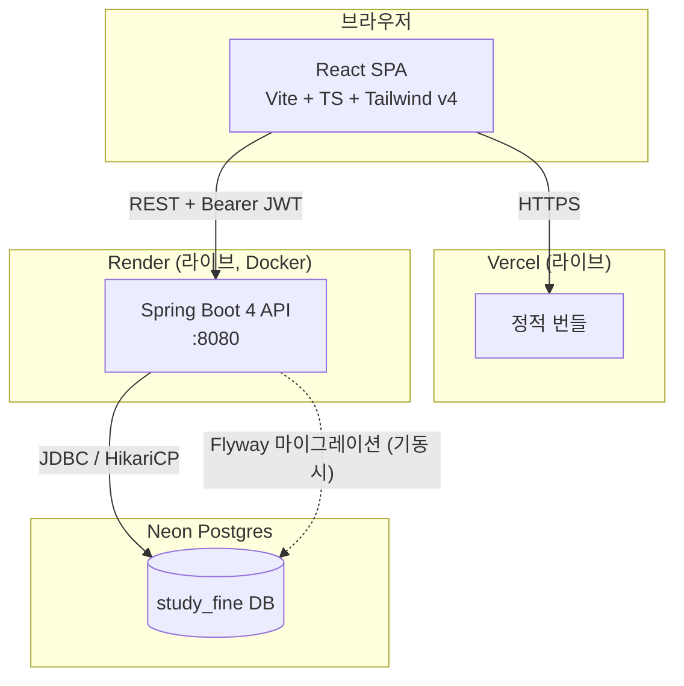

# study-fine

> 스터디모임 출석 관리 + 지각/결석 벌금 자동 계산 · **유형**: CRUD · **난이도**: S

[](https://github.com/jakesoneyo/study-fine/actions)

🔗 **라이브**: [study-fine.vercel.app](https://study-fine.vercel.app) (프론트) · [study-fine-api.onrender.com](https://study-fine-api.onrender.com) (백엔드 API) — 데모 로그인 버튼 눌러서 바로 전체 흐름 체험 가능. 콜드스타트는 아래 [배포 정책](#배포-정책) 참고

카톡방·엑셀·사람의 기억에 의존하던 스터디 출석/벌금 관리를, 회차별 출석 체크 한 번으로 벌금까지 자동 확정 저장하는 앱으로 대체한다. 자세한 배경은 [SPEC.md](./SPEC.md) 참고.

## 스크린샷 / 데모

_추후 추가 예정 (출석 체크 화면 GIF 우선)_

## 데모 계정

회원가입 없이 아래 계정으로 바로 둘러볼 수 있다. 로그인 화면의 **`회원가입 없이 둘러보기`** 버튼을 누르면 자동으로 채워진다.

| 아이디  | 비밀번호 | 권한        |
| ------- | -------- | ----------- |
| `admin` | `admin`  | `ORGANIZER` |

샘플 멤버 3명 + 회차 2개 + 출석 기록이 시드되어 있어 첫 화면부터 비어 보이지 않는다.

## 기술 스택

- **백엔드**: Spring Boot 4.1 · Java 21 · Maven · Spring Data JPA(Hibernate 7) · Flyway · Spring Security 7 + Nimbus JWT
- **프론트**: Vite · React 19 · TypeScript · Tailwind v4 · Zustand · TanStack Query · Zod · axios
- **DB**: Neon Postgres
- **배포**: 프론트 Vercel 라이브 / 백엔드 Render(Docker, 무료 티어) 라이브 (아래 정책 참고)

## 아키텍처



레이어 구조(Controller → Service → Domain/Repository)와 패키지 구조는 [ARCHITECTURE.md](./ARCHITECTURE.md) 참고.

## 배포 정책

Spring Boot는 JVM 특성상 Node 백엔드보다 메모리를 훨씬 많이 먹어서(부팅만 해도 보통 250~400MB), 이 워크스페이스는 기본적으로 Render 무료 티어(512MB)에 Spring을 올리지 않고 로컬 쇼케이스로 두는 걸 원칙으로 한다. 이 프로젝트는 예외적으로 **힙(`-Xmx256m`)·메타스페이스(`-XX:MaxMetaspaceSize=180m`)를 명시적으로 제한하고 SerialGC를 써서 512MB 컨테이너 안에서 실측 검증(기동 + API 호출 반복 후 ~396MB 안정) 후 실제로 라이브 배포했다** — 자세한 튜닝 근거는 [server/Dockerfile](./server/Dockerfile) 주석 참고.

**알아두면 좋은 것**:

- Render 무료 티어는 15분 미접속 시 슬립되고, 다음 요청에서 다시 깨어나는 데 30~60초 정도 걸릴 수 있다(콜드스타트). 첫 로그인 시도가 느리면 이 때문이다 — 새로고침하지 말고 잠깐 기다리면 된다.
- 계정(워크스페이스) 전체가 월 750 무료 인스턴스 시간을 공유하므로, 이 프로젝트만 따로 죽는 게 아니라 다른 포트폴리오 백엔드와 가동 시간을 나눠 쓴다.
- 로컬에서 직접 띄워서 확인하고 싶다면 아래 [로컬 실행](#로컬-실행) 절차를 그대로 따르면 된다.

## 핵심 기능

- 운영자가 회차를 만들고 멤버 전원의 출석 상태(출석/지각/결석)를 한 화면·한 번의 요청으로 저장(bulk upsert, 단일 트랜잭션)
- 출석 상태를 고르면 서버가 현재 벌금 단가로 벌금을 자동 계산해 **확정 저장** — 클라이언트는 금액을 보내지 않음
- 멤버는 로그인해서 본인 출석 내역과 누적 벌금만 조회(`GET /api/me/attendances`). 타인 리소스는 API로도 403

## 기술적 하이라이트

- **벌금 스냅샷** — 벌금은 조회 시점에 계산하는 파생값이 아니라, 출석 체크 시점의 단가로 `attendance_record.fine_amount`에 확정 저장한다. 이후 벌금 단가를 올려도 과거 회차 금액은 소급 변경되지 않는다(`StudyRoomService.update`는 `AttendanceRepository`를 참조조차 하지 않음 — 소급 오염 경로가 코드상 존재하지 않도록 설계). `FinePolicyTest`가 이 불변식을 테스트로 고정한다.
- **N+1 방지** — 멤버 목록의 누적 벌금, 회차 목록의 벌금 합계는 각각 `LEFT JOIN + GROUP BY` 단일 projection 쿼리로 산출한다(멤버/회차 수만큼 쿼리가 늘지 않음). 출석 체크 bulk upsert는 멤버 루프 진입 전에 기존 기록을 `Map`으로 1회 조회해두고, 루프 안에서는 리포지토리 호출 없이 순수 계산만 수행한다.
- **소유권 격리를 "비교"가 아니라 "구조"로 차단** — 본인 조회는 `GET /api/me/attendances`처럼 토큰의 `sub`만 사용하고 id 파라미터 자체를 받지 않는다. id를 받는 `GET /api/members/{id}/attendances`는 통째로 `ORGANIZER` 전용이라, "principal과 id를 비교하는 코드를 빠뜨려 생기는" 수평 권한 상승이 구조적으로 불가능하다.

## 로컬 실행

### 전제 조건

- **JDK 21 필요.** 이 환경 기준 시스템 `java`가 PATH에 없을 수 있으므로, Maven Wrapper 실행 시 `JAVA_HOME`을 명시한다(Homebrew로 설치했다면 `/opt/homebrew/opt/openjdk@21`).
- Node.js (프론트)
- Neon Postgres 커넥션 문자열 (또는 로컬 Postgres)

### 백엔드

```bash
cd server
cp .env.example .env   # DATABASE_URL, JWT_SECRET 등 값 채우기

JAVA_HOME=/opt/homebrew/opt/openjdk@21 ./mvnw spring-boot:run
```

기동 시 Flyway 마이그레이션이 자동 실행되고, `APP_SEED_ENABLED=true`(기본값)면 데모 계정과 샘플 데이터가 멱등하게 시드된다.

### 프론트

```bash
cd client
cp .env.example .env   # VITE_API_BASE_URL=http://localhost:8080
npm install
npm run dev
```

### Docker (백엔드)

```bash
cd server
docker build -t study-fine-server .
docker run --env-file .env -p 8080:8080 study-fine-server
```

## API 문서

Swagger UI: [study-fine-api.onrender.com/swagger-ui/index.html](https://study-fine-api.onrender.com/swagger-ui/index.html) (라이브) · 로컬 기동 시 `http://localhost:8080/swagger-ui/index.html`
전체 엔드포인트 15개와 권한 매트릭스는 [API.md](./API.md) 참고.

## 테스트

```bash
cd server
JAVA_HOME=/opt/homebrew/opt/openjdk@21 ./mvnw test
```

핵심 도메인 로직(`FinePolicy` 벌금 계산, 스냅샷 불변성)과 권한 가드(15개 엔드포인트 × 역할별 401/403)를 단위 테스트로 검증한다 (현재 28개 테스트 통과).

## 알려진 트레이드오프

- **토큰 보관: `localStorage`** — 새로고침 후 로그인 유지를 위해 액세스 토큰을 `localStorage`에 둔다. XSS에 노출된다는 단점이 있고, 정석은 httpOnly 쿠키지만 이는 CSRF 대응과 쿠키 도메인 설정(Vercel ↔ 로컬 백엔드의 크로스 오리진 구성)을 추가로 수반한다. S티어 범위에서는 `localStorage` + 짧은 만료(12시간)로 절충하고, 이 선택을 알고 있는 상태로 남긴다(자세한 내용은 [ARCHITECTURE.md §7](./ARCHITECTURE.md#7-프론트엔드-구조) 참고).

## 문서

- [SPEC.md](./SPEC.md) — 문제 정의, 범위, 유저 스토리, DoD
- [ARCHITECTURE.md](./ARCHITECTURE.md) — 레이어 구조, 인증 플로우, 벌금 계산 설계, N+1 방지
- [API.md](./API.md) — 엔드포인트 전체 명세, 권한 매트릭스
- [DATA-MODEL.md](./DATA-MODEL.md) — 테이블·인덱스 설계
- [DESIGN.md](./DESIGN.md) — UI 디자인 결정
